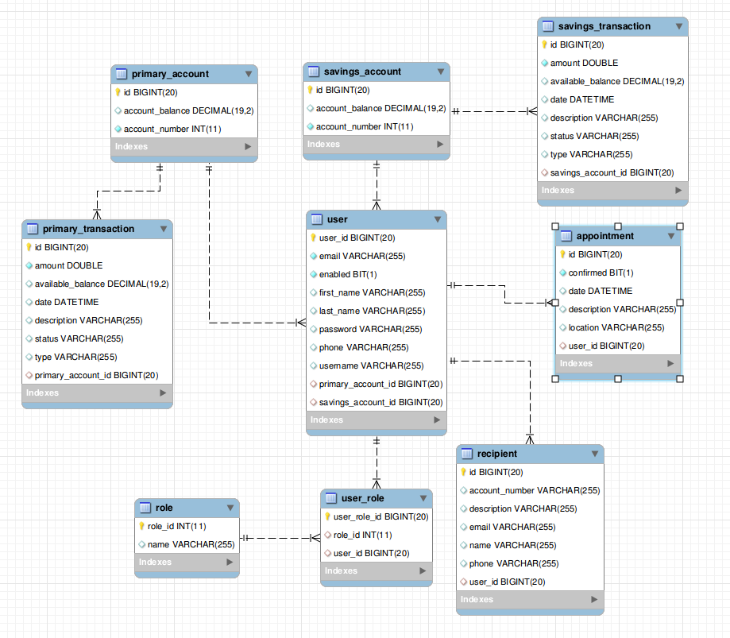

## Online Banking Project Prototype

Prototype Online Banking System using the latest Java web technologies: Java 8, Spring Boot, Spring Data, Spring Security, Hibernate, MySQL together with best practice DevOps Docker container.


## Installation instructions

#### Prerequisite

| Tool | Link |
| ------ | ------ |
| Docker | https://www.docker.com/ |

### Docker
OnlineBanking is very easy to install and deploy in a Docker container.

By default, the Docker will expose port 8080, so change this within the Dockerfile if necessary. When ready, simply use the docker-compose.yml to build the image.

```sh
git clone https://github.com/ntt2k/OnlineBanking.git
cd OnlineBanking
docker-compose up
```

### Login Online Banking Web App

http://localhost:8080/

| username | password |
| ------ | ------ |
| adamsmith | testpassword |


### The 12 Factors of App Methodology Microservices check-list

| # | Factor | Description | Status
| ------ | :------: | :------ | :------: |
| 1 | Codebase | There should be exactly one codebase for a deployed service with the codebase being used for many deployments. | :white_check_mark:
| 2 | Dependencies | All dependencies should be declared, with no implicit reliance on system tools or libraries. | :white_check_mark:
| 3 | Config | Configuration that varies between deployments should be stored in the environment. | :x:
| 4 | Backing services | All backing services are treated as attached resources and attached and detached by the execution environment. | :white_check_mark:
| 5 | Build, release, run | The delivery pipeline should strictly consist of build, release, run. | :white_check_mark:
| 6 | Processes | Applications should be deployed as one or more stateless processes with persisted data stored on a backing service. | :x:
| 7 | Port binding | Self-contained services should make themselves available to other services by specified ports. | :white_check_mark:
| 8 | Concurrency | Concurrency is advocated by scaling individual processes. | :x:
| 9 | Disposability | Fast startup and shutdown are advocated for a more robust and resilient system. | :white_check_mark:
| 10 | Dev/Prod parity | All environments should be as similar as possible. | :white_check_mark:
| 11 | Logs | Applications should produce logs as event streams and leave the execution environment to aggregate. | :x:
| 12 | Admin Processes | Any needed admin tasks should be kept in source control and packaged with the application. | :x:


## System Detail Diagram


## ER Diagram


